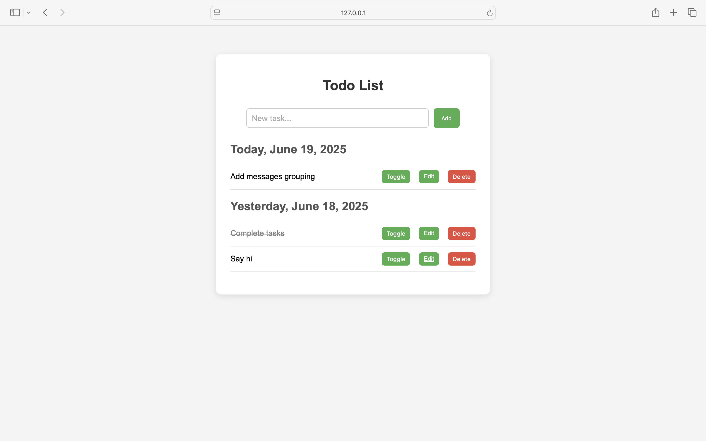

# 📝 To-Do Application (Ruby on Rails)

This is a simple To-Do List application built with Ruby on Rails. It allows users to manage tasks by adding, editing, completing, and deleting them. Added the feature to group the tasks by the date it is rendered.

---

## Technologies Used

- **Ruby**: 3.2.2
- **Rails**: 8.0.2
- **Database**: PostgreSQL
- **CSS Styling**: basic custom CSS
- **ORM**: ActiveRecord

---

Follow these steps to set up the application on your local machine.

### 1. Clone the Repository

```bash
git clone https://github.com/your-username/todo_app.git
git checkout group-by-date

cd todo_app
```

### 2.Install Ruby Gems
```bash
bundle install
```

### 3. Update your config/database.yml with your PostgreSQL credentials in pace of username and password in database.yml
Then run:
```bash
rails db:create
rails db:migrate
```
### 4. Run the Rails Server
```bash
rails server
```
Visit: http://localhost:3000

### 5. Features

- User will be able to enter and store the to do tasks.
- User will be able to mark as save, edit and delete the entered tasks.
- The entries will be stored in Postgresql.

### Output images
 
